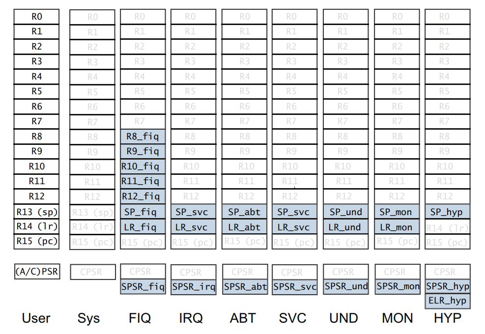

# 中断

ARMv7
	含义：指ARM处理器的第7版指令集架构（ISA），属于ARM架构的软件规范层。
	定位：定义了处理器必须支持的指令集、内存管理机制（如虚拟化、大物理地址扩展LPAE）和核心功能		（如NEON SIMD、硬件虚拟化）。
	应用范围：包含三个子系列：
		Cortex-A（应用处理器，如手机/平板）
		Cortex-R（实时控制，如汽车电子）
		Cortex-M（微控制器，如物联网设备）。

Cortex-A7
	含义：基于ARMv7-A架构设计的具体处理器内核（微架构实现）。
	定位：专注高能效比，主打低功耗场景（如入门级手机、嵌入式设备），支持1~4核配置，性能接近Cortex-A9但功耗更低。
	技术特性：
		支持ARMv7-A的全部功能（如TrustZone安全扩展、NEON多媒体指令）。
		可与高性能内核（如Cortex-A15）组成big.LITTLE架构，动态切换以平衡性能与功耗。

## Cortex-A7运行模式和寄存器

上面这张图来自Cortex-A7 Technical ReferenceManua.pdf，详细列出了**Cortex-A7的所有核心寄存器**，**其中R0-R15被称为通用寄存器**，**CPSR和SPSR寄存器被称为程序状态寄存器**。

### 协处理器

另外，Cortex-A7 支持 16 个协处理器CP0-CP15，**其中CP15被称为系统控制协处理器，控制着MMU、cache等关键组件，最多有16个32位的寄存器c0-c15。**通过 c0 寄存器可以获取到处理器内核信息；通过 c1 寄存器可以使能或禁止 MMU、 I/D Cache 等；通过 c12 寄存器可以设置中断向量偏移；通过 c15 寄存器可以获取 GIC 基地址。

### 通用寄存器和CPSR/SPSR描述

在16个通用寄存器中

- **R0-R7：在所有运行模式下共享相同的物理寄存器**
- **R8-R12：在FIQ模式下有专用的寄存器**
- **R13：栈指针寄存器，指向当前模式的栈顶。每种模式下都有专用的物理寄存器**
- **R14：链接寄存器，保存着子程序的返回地址**
- **R15：程序计数器，指向当前执行指令的地址。所有模式下通用**

​	

**CPSR寄存器保存当前处理器状态（条件标志位、中断使能、当前模式等），所有运行模式共享相同的物理寄存器。**

- M[4:0]：指示当前模式（如 0b10000 表示 SVC 模式）。
- N/Z/C/V：算术运算结果标志（负数、零、进位、溢出）。
- I/F：中断屏蔽位（禁止 IRQ/FIQ）。
- T：ARM/Thumb 状态标志。

**SPSR寄存器在异常（）情况下保存CPSR寄存器的值，每种模式下有专用的物理寄存器。**

## Cortex-A7中断系统

Cortex-A7一共有8个异常中断

| 向量地址 |               中断类型                |         中断模式          |
| :------: | :-----------------------------------: | :-----------------------: |
|   0X00   |            复位中断(Reset)            |       特权模式(SVC)       |
|   0X04   | 未定义指令中断(Undefined Instruction) | 未定义指令中止模式(Undef) |
|   0X08   |    软中断(Software Interrupt,SWI)     |       特权模式(SVC)       |
|   0X0C   |   指令预取中止中断(Prefetch Abort)    |         中止模式          |
|   0X10   |     数据访问中止中断(Data Abort)      |         中止模式          |
|   0X14   |           未使用(Not Used)            |          未使用           |
|   0X18   |        IRQ 中断(IRQ Interrupt)        |     外部中断模式(IRQ)     |
|   0X1C   |        FIQ 中断(FIQ Interrupt)        |     快速中断模式(FIQ)     |

## GIC中断控制器

GIC在ARMv7及以后的架构中被广泛采用，如Cortex-A系列处理器。目前 GIC 有 4 个版本:V1~V4。V1已经被废弃了。GIC V2 是给 ARMv7-A 架构使用的，比如 Cortex-A7、 Cortex-A9、 Cortex-A15 等，V3 和 V4 是给 ARMv8-A/R 架构使用的，也就是 64 位芯片使用的。

当 GIC 接收到外部中断信号以后就会报给 ARM 内核，但是ARM 内核只提供了四个信号给 GIC 来汇报中断情况：

VFIQ:虚拟快速 FIQ；

VIRQ:虚拟外部 IRQ；

FIQ:快速中断 IRQ；

IRQ:外部中断 IRQ。

**我们只关注FIQ和IRQ。**

 GIC 将众多的中断源分为分为三类：
①、 ==SPI(Shared Peripheral Interrupt),共享中断==，顾名思义，所有 Core 共享的中断，这个是最常见的，**那些外部中断都属于 SPI 中断(注意！不是 SPI 总线那个中断) 。比如按键中断、串口中断等等**，这些中断所有的 Core 都可以处理，不限定特定 Core。
②、 ==PPI(Private Peripheral Interrupt)，私有中断==，我们说了 GIC 是支持多核的，每个核肯定有自己独有的中断。这些独有的中断肯定是要指定的核心处理，因此这些中断就叫做私有中断。
③、 ==SGI(Software-generated Interrupt)，软件中断==，由软件触发引起的中断，通过向寄存器GICD_SGIR 写入数据来触发，系统会使用 SGI 中断来完成多核之间的通信。

**每个CPU最多支持1020个中断，也就对应着1020个中断号。**

| 中断号     | 分配情况                                                     |
| ---------- | ------------------------------------------------------------ |
| D0~ID15    | 这 16 个 ID 分配给 SGI（软件中断）                           |
| ID16~ID31  | 这 16 个 ID 分配给 PPI（私有中断）                           |
| D32~ID1019 | 这 988 个 ID 分配给 SPI（共享中断），像 GPIO 中断、串口中断等这些外部中断。这些中断号由半导体厂商针对自家的芯片进行分配 |

### GIC架构

**GIC架构分为2部分，分发器和CPU接口。**

**分发器负责管理中断，例如中断触发条件，优先级设置，中断使能，每个中断由那个处理器执行等等。**

**每个CPU核心都能在GIC找到自己对应的CPU接口。CPU接口负责向CPU发送中断请求，应答中断，中断处理完成通知等等。**

==**GIC 控制器的寄存器基地址在CP15协处理器的c15寄存器中**==

## 中断处理流程

1. 外设触发中断信号到GIC
2. GIC将中断请求发送给CPU
3. CPU硬件自动完成：
	1. 切换到IRQ模式
	2. 保存CPSR到SPSR_irq
	3. 保存返回地址到LR_irq（当前PC+4或+8）
	4. 跳转到VBAR + 0x18地址执行（VBAR寄存器保存着中断向量表的偏移地址， 0x18对应着IRQ中断异常）

```mermaid
graph TD
    A[异常发生] --> B[CPU自动操作]
    B --> C1[切换对应模式]
    B --> C2[保存CPSR到SPSR_mode]
    B --> C3[保存PC到LR_mode]
    B --> D[计算向量地址：VBAR+偏移]
    D --> E[执行向量处指令]
    E --> F[跳转到实际处理程序]
    F --> G[保存上下文/处理异常]
    G --> H[恢复上下文]
    H --> I[异常返回指令]
    I --> J[恢复CPSR和PC]
```

